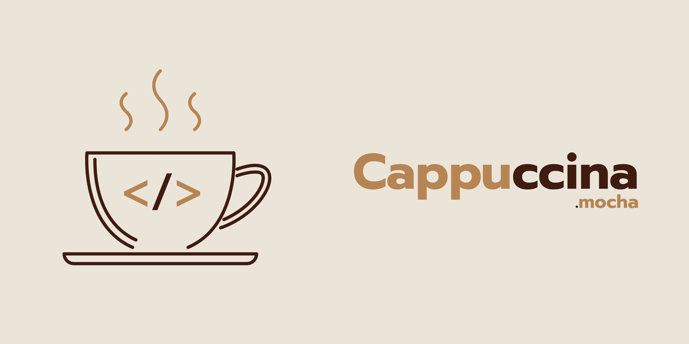

# ☕ Cappuccina

Cappuccina é uma linguagem de programação desenvolvida como parte da disciplina de **Compiladores**, com foco em **funções primitivas** e **μ-recursivas**. Seu principal objetivo é servir como **ferramenta pedagógica**, permitindo que estudantes explorem conceitos teóricos de forma prática e compreendam melhor a construção de um compilador.

> 📚 Em breve, publicaremos um artigo explicando a construção da linguagem Cappuccina com todos os detalhes técnicos e pedagógicos envolvidos: <https://docs.google.com/document/d/1Whajt53p7Gg_klY_zoSjm38cY_VgLhpD/edit>.

---

## 🔧 Instalação

Para compilar a linguagem, é necessário ter o **Bison** e o **Flex** instalados. Execute os comandos abaixo no terminal Linux ou no WSL (Windows Subsystem for Linux):

```bash
sudo apt update
sudo apt install bison flex -y
bison --version  # Verifique se o Bison foi instalado corretamente
flex --version   # Verifique se o Flex foi instalado corretamente
```
## 📁 Estrutura do Projeto

```bash
.
├── Makefile             # Script de compilação
├── main.c               # Ponto de entrada da linguagem
├── parser.y             # Arquivo Bison (gramática)
├── lexer.l              # Arquivo Flex (analisador léxico)
├── ast.c / ast.h        # Estrutura da árvore sintática
├── eval.c / eval.h      # Avaliação das expressões
├── mocha/               # Contém extensão VSIX para o VS Code
└── proj.mocha           # Exemplos de código em Cappuccina
```

## ⚙️ Compilação e Execução

Use os comandos abaixo para compilar o projeto e executar um arquivo .mocha:
```bash
make
./cappuccina < nome_do_arquivo.mocha
```

## 🌈 Suporte à extensão .mocha no VS Code
Na pasta mocha/ há um arquivo .vsix que permite que o VS Code reconheça automaticamente arquivos com a extensão .mocha.

Como instalar:
1. Acesse o VS Code.
2. Vá para o menu Extensões (Ctrl+Shift+X).
3. Clique nos três pontinhos (⋯) no topo da aba e escolha "Instalar do VSIX...".
4. Selecione o arquivo .vsix dentro da pasta mocha/.

Após isso, arquivos .mocha terão realce de sintaxe personalizado e integração visual no editor.


